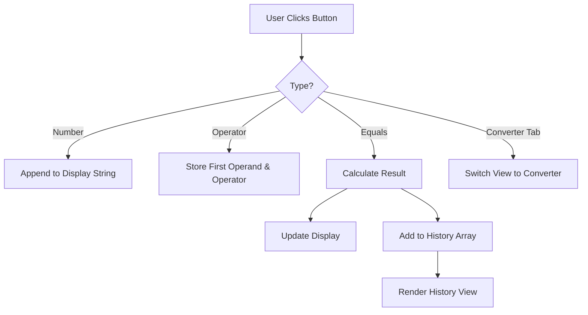
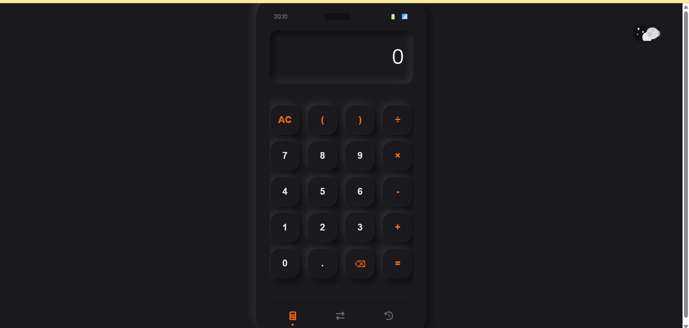

# 🐔 Barebones Calculator & Converter


> **"Not just a calculator, it's a Neumorphic Experience."**

A visually stunning, **Neumorphic (Soft UI)** calculator and currency converter application built with vanilla web technologies. It features a playful, animated "Day/Night" toggle, a robust history system, and a realistic mobile-style interface.

---

## 🌟 Key Features

### 🎨 **premium Neumorphic Design**
- **Soft UI Aesthetics**: Elements appear extruded from the screen with realistic light and dark shadows.
- **Fluid Animations**: Smooth transitions between views and interactions.
- **Responsive Layout**: Designed to look and feel like a native mobile app on any device.

### 🌗 **"Jolly Chicken" Theme Toggle**
A custom-built, purely CSS animated switch that brings the UI to life:
- **☀️ Day Mode**: A bright sun rises with floating clouds (`.cloud-light`, `.cloud-dark`) on a soft white background.
- **🌙 Night Mode**: A cratered moon appears with twinkling stars (`.star`) on a deep charcoal background.

### 🛠 **Functional Versatility**
1.  **🧮 Standard Calculator**: 
    - Full arithmetic operations (`+`, `-`, `×`, `÷`).
    - Smart text entry and deletion.
    - Floating point precision handling.
2.  **💱 Currency Converter**: 
    - Dedicated view with "Source" and "Target" currency cards.
    - **Real-time Simulation**: Includes conversion rates for **40+ currencies** (Base: INR).
    - Swap functionality to instantly reverse source/target.
3.  **📜 History Log**:
    - Keeps track of your last 20 calculations *and* conversions.
    - **Interactive**: Click any history item to load the result back into the main calculator!

---

## 📂 Project Analysis

This project consists of three core files that separation of concerns:

### 1. `thumb.html` (The Skeleton)
- **Structure**: Acts as the main container (`.app-container`).
- **Views**: Defines three distinct sections within `.calculator-frame`:
    - `#view-calculator`: The main keypad and display.
    - `#view-converter`: The currency conversion interface.
    - `#view-history`: The list of past operations.
- **Assets**: Embeds FontAwesome icons and Google Fonts (Poppins).

### 2. `main.css` (The Style & Soul)
- **Variables (`:root`)**: Heavily uses CSS variables for effortless theming.
    - *Example*: `--neu-shadow` changes dynamically based on the `light-mode` class.
- **Animations**: 
    - `@keyframes star-twinkle`: Creates the pulsing star effect in Night Mode.
    - Transitions on `.view` allow for the smooth sliding/fading effect when switching tabs.
- **Neumorphism**: Achieved via complex `box-shadow` properties:
    ```css
    --neu-shadow: 6px 6px 16px var(--shadow-dark), -6px -6px 16px var(--shadow-light);
    ```

### 3. `end.js` (The Brain)
- **State Management**: Tracks current arithmetic strings, operations, and currency inputs.
- **DOM Manipulation**: Listeners for every button press to update the UI instantly.
- **Navigation Logic**: Manages the bottom nav bar to toggle `display: none/flex` and opacity classes for views.
- **Currency Logic**: Contains a hardcoded object `currencies` with exchange rates relative to INR, allowing for offline-capable conversion logic.

---

## 🚀 Getting Started

No build tools or heavy framework installations required!

1.  **Clone the Repository**
    ```bash
    git clone https://github.com/yourusername/barebones-calculator.git
    ```
2.  **Run the App**
    - Simply double-click `thumb.html` to open it in Chrome, Firefox, Safari, or Edge.
    - **Pro Tip**: Use the VS Code "Live Server" extension for the best experience.

---

## 🧩 Logic Flow

Here is how the application handles a user action:



## 📸 Screenshots



---

## 🤝 Contributing

1. Fork it!
2. Create your feature branch: `git checkout -b my-new-feature`
3. Commit your changes: `git commit -am 'Add some feature'`
4. Push to the branch: `git push origin my-new-feature`
5. Submit a pull request.

---

<p align="center">Made with ❤️ and a lot of CSS <code>box-shadow</code>.</p>
